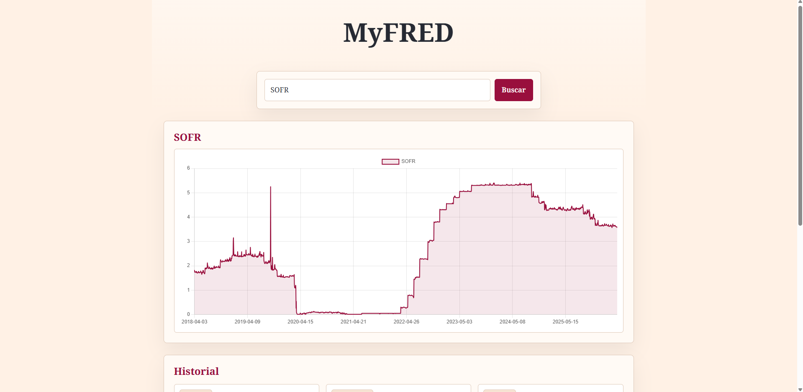

# MyFRED


Buscador de series economicas de FRED con graficos interactivos, historial persistente y backend propio para evitar problemas de CORS.



## Descripcion

MyFRED es una aplicacion frontend en React que replica, de forma simplificada, una experiencia de consulta de datos economicos basada en FRED (Federal Reserve Economic Data). Permite buscar una serie por su identificador, por ejemplo `GDP`, `UNRATE` o `CPIAUCSL`, visualizar sus observaciones en un grafico y conservar las busquedas en el historial.

El proyecto incluye un backend ligero con Express que actua como proxy entre el navegador y la API de FRED. De esta forma, la clave de API no queda expuesta en el frontend y se evitan bloqueos de CORS al consultar los datos.

## Caracteristicas

- Busqueda de series economicas por identificador de FRED.
- Visualizacion de datos en graficos de linea con Chart.js.
- Backend proxy con Express para proteger la API key y evitar CORS.
- Historial persistente en `localStorage`.
- Cards de historial con mini-graficos de las series guardadas.
- Notificaciones visuales para carga, exito y errores.
- Estilo visual con `Noto Serif`, fondo salmon y color de destaque granate.

## Tecnologias Utilizadas

- React 19
- Vite 8
- TanStack React Query
- Chart.js
- React Chart.js 2
- Sonner
- Node.js
- Express
- npm workspaces
- concurrently

## Instalacion

### Prerrequisitos

- Node.js 20 o superior.
- npm incluido con Node.js.
- Una API key de FRED.

### 1. Clonar el repositorio

```bash
git clone https://github.com/Jaldekoa/myfred
cd myfred
```

### 2. Instalar dependencias

```bash
npm install
```

### 3. Configurar variables de entorno

Crea el archivo `backend/.env` usando como base `backend/.env.example`:

```bash
cp backend/.env.example backend/.env
```

Ejemplo de `backend/.env`:

```env
FRONTEND_PORT=5173
BACKEND_PORT=4000
FRED_API_KEY=tu_api_key_de_fred
FRED_API_URL=https://api.stlouisfed.org/fred/series/observations
```

Variables obligatorias:

- `FRONTEND_PORT`: puerto donde corre Vite.
- `BACKEND_PORT`: puerto donde corre el servidor Express.
- `FRED_API_KEY`: clave personal de la API de FRED.
- `FRED_API_URL`: endpoint de observaciones de FRED.

El frontend tambien necesita saber donde esta el backend. Revisa `frontend/.env.development`:

```env
VITE_API_BASE_URL=http://localhost
VITE_BACKEND_PORT=4000
```

### 4. Levantar el proyecto completo

Desde la raiz del proyecto:

```bash
npm run dev
```

Esto levanta en paralelo:

- Frontend: `http://localhost:5173` o el siguiente puerto libre si Vite lo necesita.
- Backend: `http://localhost:4000`.

### 5. Probar una busqueda

Abre el frontend en el navegador y busca una serie valida:

```txt
GDP
UNRATE
CPIAUCSL
```

Si la busqueda es correcta, se mostrara el grafico principal y se guardara una card en el historial.

## Scripts Disponibles

Desde la raiz:

```bash
npm run dev
```

Desde el frontend:

```bash
npm run dev -w frontend
npm run build -w frontend
npm run lint -w frontend
npm run preview -w frontend
```

Desde el backend:

```bash
npm run dev -w backend
npm run start -w backend
```

## Estructura de Archivos

```txt
myfred/
├── backend/
│   ├── .env.example
│   ├── package.json
│   └── src/
│       ├── index.js      # Servidor Express y ruta /api/:series_id
│       └── utils.js      # Construccion de URL y filtrado de query params
├── frontend/
│   ├── .env.development
│   ├── index.html
│   ├── package.json
│   └── src/
│       ├── App.jsx
│       ├── App.css
│       ├── index.css
│       ├── main.jsx
│       ├── components/
│       │   ├── Chart.jsx
│       │   ├── ChartContainer.jsx
│       │   ├── Dashboard.jsx
│       │   ├── Header.jsx
│       │   ├── SavedSeriesList.jsx
│       │   └── Search.jsx
│       └── hooks/
│           ├── useSavedSeries.jsx
│           └── useSearch.jsx
├── package.json
├── package-lock.json
└── README.md
```

## Estructura del Prototipo

- **Home / Dashboard:** contiene el titulo, el buscador, el grafico principal y el historial.
- **Buscador:** permite introducir un `series_id` de FRED y lanzar la consulta.
- **Grafico principal:** muestra la serie buscada con un grafico de linea.
- **Historial:** muestra las series consultadas como cards con mini-graficos guardados en `localStorage`.
- **Backend proxy:** expone `/api/:series_id` y delega la consulta real a FRED.

## Enfoque Tecnico

- Separacion entre frontend y backend mediante npm workspaces.
- Arranque simultaneo de frontend y backend con `concurrently`.
- React Query para cachear y gestionar estados de peticion.
- Express como proxy para centralizar la llamada a FRED.
- Persistencia local con `localStorage`.
- Componentes reutilizables para graficos grandes y mini-graficos.
- Estilos CSS simples priorizando claridad, jerarquia visual y responsive basico.

## Autor

[](https://github.com/Jaldekoa)
[](https://www.linkedin.com/in/jaldekoa/)
